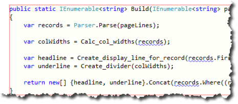
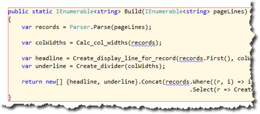
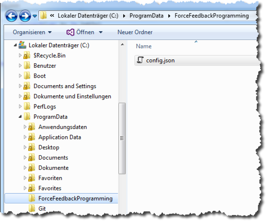

# Configuring the VS Extension

The Visual Studio extension for Force Feedback Programming provides visual plus tactile feedback on the evolvability of your code while typing.

Since not all code is created equal and your team's coding style might differ from that of another team you can configure the extension's "sensitivity" and its "use of force".

As the metric to determine how clean/dirty your code is the extension (currently only) uses the number of lines of a method.

This method consists of 10 lines of code starting from the initial `{` and ending with `}`. A background color is chosen accordingly:



Adding a line (by breaking the last statement apart) pushes it into the next "brownfield category", though, and the background color changes:



## config.json

Currently the information about the "brownfield categories" is stored in a global config file _config.json_ located at `c:\ProgramData\ForceFeedbackProgramming`:



A [sample config file](config.json) is stored next to this documentation in the repo. It's structure is simple:

```
{
  "methodTooLongLimits": [
    {
      "lines": 6,
      "color": "#ffffe5",
      "transparency": 0.25
    },
    {
      "lines": 11,
      "color": "#fee391",
      "transparency": 0.25,
      "noiseDistance": 10
    },
    ...
}
```
The `methodTooLongLimits` list contains entries for each "brownfield category".

In each category you can set the number of lines (`lines`) it starts at. In the example above the first category starts with 6 lines of code in a methode. Once 11 lines of code are reached the second category takes over and so on. That means code with less than 6 lines of code falls into no category. It's not colored. It's considered clean. But from 6 lines of code on code is deemed to grow dirty...

The `color` property determines how to color a method's background once it falls into a certain category. If you want to adapt the colors to your liking find inspiration (and hex codes) here: [http://www.rapidtables.com/web/color/gray-color.htm](http://www.rapidtables.com/web/color/gray-color.htm)

`transparency` determines how "thick" the color is applied. A lower number means less "thickness"/opacity. For most colors/categories a value of 0.25 seems ok.

So much for the visual feedback. The final value is about the tactile feedback:

`noiseDistance` determines how often the extension is supposed to add noise to your input. Currently we use the character ⌫ to irritate you. A value of 10 means "every 10 characters you type" you'll see an addition noise character in your code - which you then need to delete, which slows you down, which hopefully motivates your to reduce the number of lines of code in the method to avoid such tactile noise.


