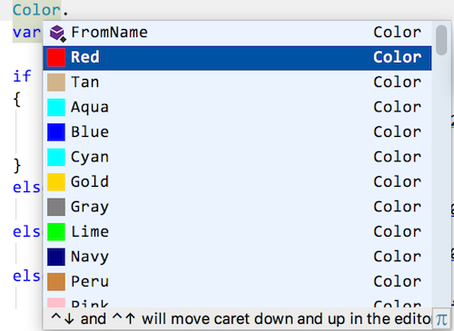

# Force Feedback Configuration

Which feedback to give is not a decision of the ``ForceFeedbackMachine``, but of the programmer. The machine
just selects the appropriate decision for a certain code situation. It's an engine applying rules from a configuration.

## Config files
The rules for the feedback are given by the programmer as config files with the name ``.forcefeedbackprogramming``.
Config files can be located at difference places:

* where the solution resides the current method belongs to,
* where the project resides, or 
* where the file of the current method resides.

For a given source file the config file which is closest to it is consulted.

If no config file is found a config file with default values is created next to the solution.

## Feedback rules

The feedback config structure generally is as follows. Each rule consists of several properties:

* ``lines``: number of lines in function from when on a certain feedback should be applied

* Properties for **visual feedback**
  * the background color for the function in the IDE if the threshold has been reached; see the below
  image for where to what color names relate to. See [here](http://www.99colors.net/dot-net-colors) for a list of color names.
  Alternatively colors can be given as RGB hex codes (e.g. ``#8A2BE2`` instead of `BlueViolet`).
  * the background color transparency; this is to make colors lighter/darker to get 
  the desired contrast for the text; smaller values mean less transparency, e.g. 0.1 (10%) is less transparent
  (more opaque, lighter) than 0.85 (85%).
  

  
* Properties for **tactile feedback**
  * after how many characters entered should noise be inserted into the source code?
  * how many noise characters should be inserted?
  * how many milliseconds should changes be delayed?

An example config file:

```
{
  "version": "1.0",
  
  "feedbackrules": [
    {
      "lines": 10,
      
      "color": "Beige",
      "transparency": 0.25
    },
    {
      "lines": 20,
      
      "color": "#BDB76B", // DarkKhaki
      "transparency": 0.25,
      
      "noiseDistance": 20
    },
    {
      "lines": 50,
      
      "color": "Maroon",
      "transparency": 0.50,
      
      "noiseDistance": 10,
      "noiseLevel": 3
    },
    {
      "lines": 100,
      
      "color": "Sienna",
      "transparency": 0.10,
      
      "noiseDistance": 10,
      "noiseLevel": 5,
      "delay": 200
    }
  ]
}
```

Explanation:

* No feedback will be given for methods with less than 10 lines.
* Method with 10 up to 19 lines will be underlayed with a beige background with 25% transparency.
* Methods from 20 up to 49 lines with become dark khaki (25% transparency) and changes will be hampered by 1
noise character (default) every 20 characters inserted.
* Methods with 50 to 99 lines will be maroon (50%) and typing will be disturbed with 3 characters every 10 insertions.
* Finally from 100 lines on all methods will be colored in sienna (10% transparency) and every 10 insertions 5 noise chars
will be inserted - plus the typing will be delayed by 200msec.
